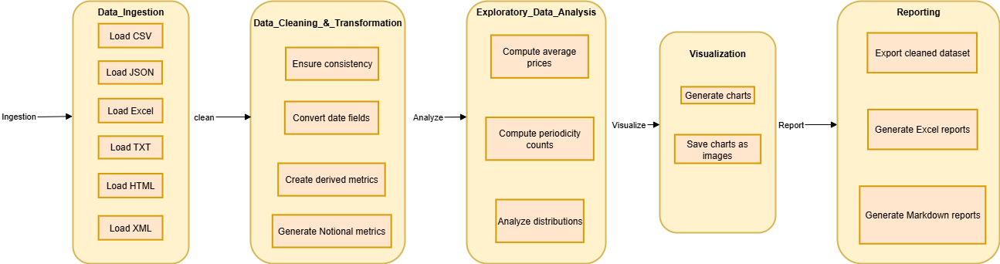
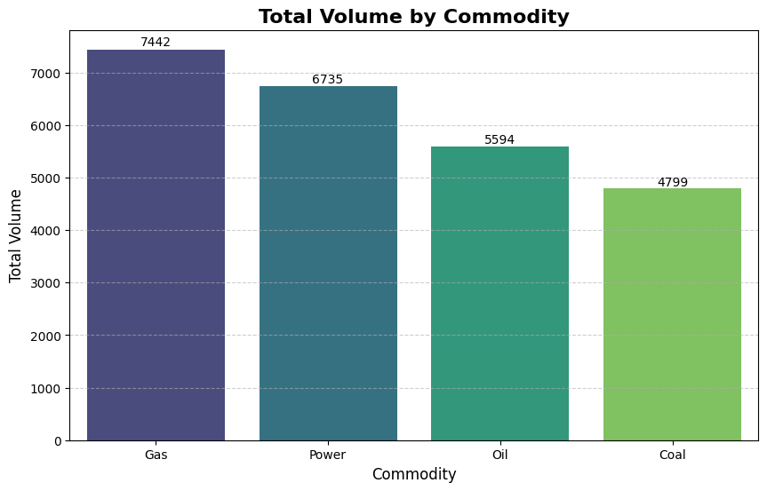
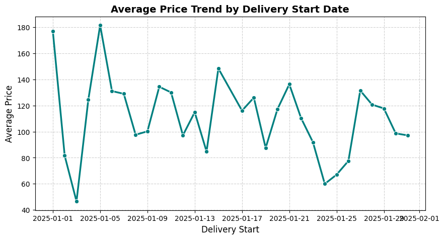
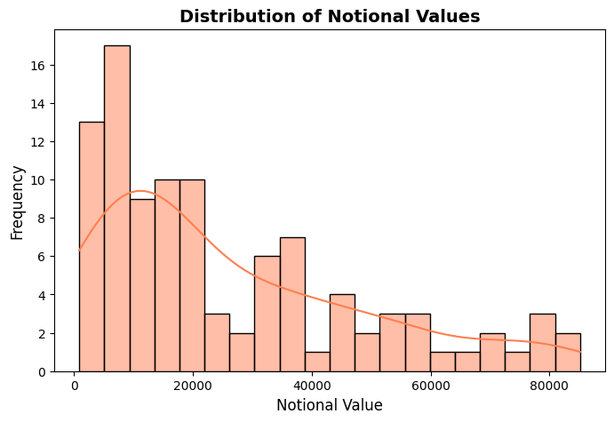
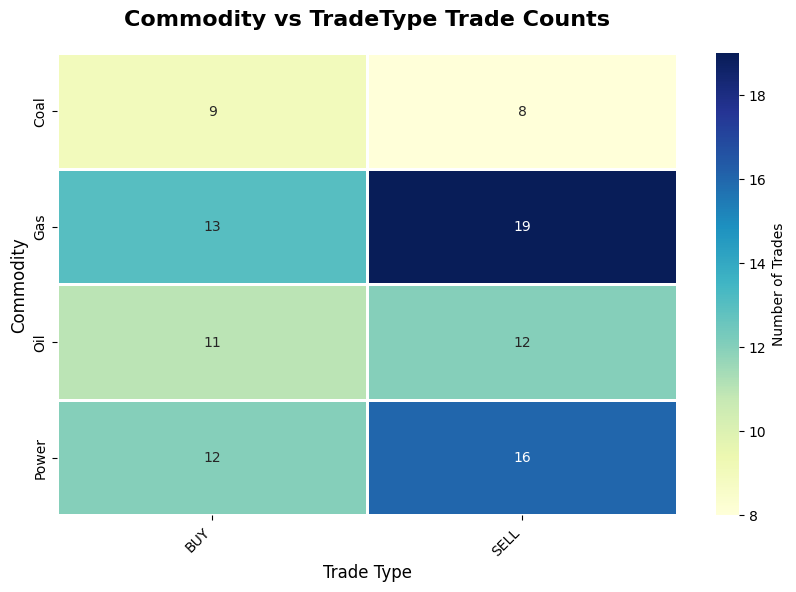

# ⚡ ETRM Data Analysis Project

## 📌 Project Overview
This project performs **Exploratory Data Analysis (EDA)** on synthetic **Energy Trading and Risk Management (ETRM)** trade data.  
The dataset simulates trades of commodities (like Oil, Gas, Power) across multiple trade types and currencies.  

The goal is to:  
- Ingest data from multiple file formats.  
- Clean, transform, and enrich the dataset.  
- Generate **visual insights** (charts, plots, tables).  
- Export findings into Excel and Markdown reports.  

---

## 🎯 Objectives
- Handle **multi-format data ingestion** (CSV, JSON, Excel, TXT, HTML, XML).  
- Create derived metrics such as **Notional (Volume × Price)**.  
- Perform **EDA** to understand trends, distributions, and trade patterns.  
- Generate **5+ professional charts** saved into an `output/` folder.  
- Produce **summary reports** in Excel and Markdown.

  ---

## Architecture

  ---

## 📂 Dataset Details
The dataset is stored in the `data/` folder and contains trade records in various formats.  

### Columns:
- **TradeID** → Unique identifier for each trade  
- **Commodity** → Type of commodity (Oil, Gas, Power, etc.)  
- **TradeType** → Physical or Derivative trade  
- **Volume** → Trade volume  
- **Price** → Unit price of trade  
- **Currency** → Trade currency (USD, EUR, GBP, etc.)  
- **DeliveryStart** → Trade delivery start date  
- **DeliveryEnd** → Trade delivery end date  
- **Periodicity** → Frequency of trade (Daily, Weekly, Monthly)  
- **Notional** → Derived = `Volume × Price`  

---

## 🛠️ Technologies Used
- **Python 3.13**  
- **Jupyter Notebook (VS Code)**  
- **Libraries**:  
  - `pandas` → data handling  
  - `numpy` → calculations  
  - `matplotlib` → plots  
  - `seaborn` → advanced visualizations  
  - `lxml` → XML/HTML parsing  
  - `openpyxl` → Excel reporting  

---

## 🔄 Workflow
1. **Data Ingestion**  
   Load files from `data/` (CSV, JSON, Excel, TXT, HTML, XML).  

2. **Data Cleaning & Transformation**  
   - Convert dates to datetime format.  
   - Add `Notional` column.  

3. **EDA (Exploratory Data Analysis)**  
   - Average price per commodity.  
   - Trades by currency.  
   - Periodicity distribution.  
   - Notional distribution.  

4. **Visualization**  
   Generate charts with **Seaborn & Matplotlib**, saved into `output/`.  

5. **Reporting**  
   - Excel summary file (`etrm_analysis_summary.xlsx`)  
   - Markdown summary file (`etrm_analysis_summary.md`)  

---

## 📊 Visualizations

### 1️⃣ Total Volume by Commodity  

---

### 2️⃣ Trades by Currency  

---

### 3️⃣ Average Price Trend  

---

### 4️⃣ Notional Value Distribution  

---

### 5️⃣ Commodity vs TradeType Heatmap  

---

## 📑 Key Insights
- Commodities show **different trade volumes** (some dominate).  
- Currencies are not equally distributed – certain currencies dominate.  
- Price trends show **fluctuations over delivery dates**.  
- Notional values cover a **wide range**, showing both small and large trades.  
- Heatmap highlights relationships between **commodities and trade types**.  

---

## 📂 Generated Outputs
Inside the `output/` folder you will find:  
- `volume_by_commodity.png` → Bar chart  
- `trades_by_currency.png` → Donut chart  
- `price_trend.png` → Line chart  
- `notional_distribution.png` → Histogram + KDE  
- `commodity_vs_tradetype.png` → Heatmap  
- `etrm_analysis_summary.xlsx` → Excel report  
- `etrm_analysis_summary.md` → Markdown summary  

---

## ▶️ How to Run the Project
1. Clone this repository: 
   git clone https://github.com/your-username/etrm-data-analysis.git 
   cd etrm-data-analysis 

2. Create and activate a virtual environment: 
    python -m venv venv 
    venv\Scripts\activate   # Windows 
    source venv/bin/activate   # macOS/Linux 

3. Run the following command to install all required libraries: 
   pip install pandas matplotlib seaborn numpy lxml openpyxl 

4. Launch Jupyter Notebook: 
   jupyter notebook 
   Open etrm_analysis.ipynb and run the cells. 

5. Check results in the output/ folder.

**Enjoy the coding!!!!....**   
